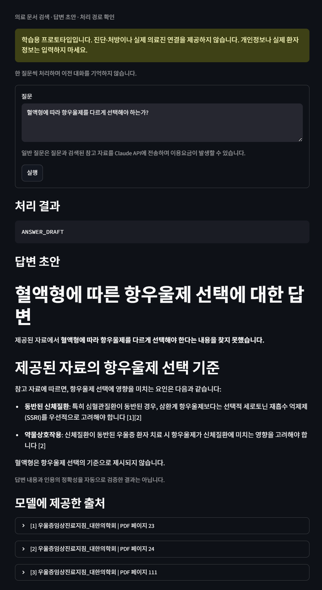

# MindGuide — 의료 문서 RAG 

우울증 임상진료지침 PDF에서 질문과 관련된 문단을 검색하고, 출처를 포함한 답변 초안을 보여주는 **로컬 프로토타입**입니다.
PDF 추출·청킹부터 벡터 검색, 평가, Claude 답변 생성, 규칙 기반 입력 분기와 웹 화면까지 단계별로 구현했습니다.

> **1차 구현 범위 동결: 2026-09-07.** 진단·처방·응급 판단을 제공하는 의료 서비스가 아닙니다. 답변과 인용의 정확성, 개인정보 차단의 완전성, 임상적 안전성을 보장하지 않습니다.

## 실제 구현 화면

아래는 사용자가 직접 실행해 제공한 화면입니다. 성공만 보여주기 위한 예시가 아니라 **근거 부족을 언급한 뒤에도 추가 설명을 생성하는 한계**가 관찰된 실제 결과입니다. 합성 이미지가 아니며 답변을 편집하지 않았습니다.

<details>
<summary>웹 화면 보기 — 근거 부족 질문과 답변 초안</summary>



</details>

화면에서 질문 입력, 처리 상태, 답변 초안, 모델에 제공한 출처의 PDF 페이지·청크 ID를 확인할 수 있습니다. 다른 실행에서 표현과 인용이 달라질 수 있습니다. [개인 증상 질문의 분기 누락 화면](docs/images/clinical-routing-miss.png)도 미해결 사례로 남겼습니다.

## 구현한 것

| 영역 | 구현 내용 |
|---|---|
| 문서 처리 | PyMuPDF 페이지별 추출, 문자 기준 300자 청킹·50자 overlap |
| 검색 | E5-small 384차원 정규화 임베딩, 코사인 유사도, Qdrant local |
| 출처 추적 | 문서 ID, PDF 페이지, 청크 ID, 원문 URL을 payload와 함께 저장 |
| 검색 평가 | 수동 검수한 8개 질문으로 Page·Evidence Hit@K, MRR@5 측정 |
| 거부 임계값 실험 | 양성 8개·무근거 8개 질문의 점수 분포와 허용/거절 지표 비교 |
| 답변 초안 | LangChain 프롬프트와 ChatAnthropic으로 Claude 호출 |
| 입력 분기 | LangGraph의 고정 조건 분기로 빈 입력·일부 개인정보·의료 판단 요청·위기 관련 표현 처리 |
| 웹 화면 | Streamlit 질문 입력, 처리 결과, 답변, 출처 표시 |

사용 문서는 **우울증 진료지침 PDF 한 종**입니다. 범용 의료 지식 전체를 다루지 않습니다. 현재 로컬 파일 확인 결과는 PDF 152페이지, 비어 있지 않은 텍스트 페이지 136개, 청크 747개입니다.

## 작동 과정

문서 준비는 질문할 때마다 하지 않고 먼저 한 번 수행합니다.

```text
[문서 준비: stage7_demo.py]
PDF → 페이지별 텍스트 → 청크(300자 / overlap 50자)
    → E5 passage 임베딩 → Qdrant에 벡터·본문·출처 저장

[질문 처리: stage11_demo.py → stage12_demo.py에서 호출]
웹 질문 → 규칙 기반 입력 검사
           ├─ 고정 안내 경로 → 안내 표시 → 종료
           └─ 일반 질문
                → E5 query 임베딩 → Qdrant Top-3 검색
                → 번호가 붙은 참고 자료 구성
                ├─ 참고 본문이 비어 있음 → NO_EVIDENCE
                └─ 본문 있음 → Claude → ANSWER_DRAFT → 답변·출처 표시
```

LangGraph는 미리 작성한 경로를 연결하는 **조건부 워크플로**입니다. 자율적으로 계획을 세우거나 도구를 선택하는 Agent는 아닙니다. 질문마다 새 상태를 사용하며 이전 대화를 기억하지 않습니다.

### 처리 상태의 정확한 의미

| 상태 | 현재 구현의 의미 |
|---|---|
| `EMPTY_INPUT` | 공백을 제거한 질문이 비어 있음 |
| `PII_BLOCK` | 정규식에 해당하는 휴대폰·이메일·주민번호 형태를 발견 |
| `CLINICIAN_REVIEW` | 등록한 표현을 발견해 의료진 상담 안내 표시. 실제 전달 없음 |
| `EMERGENCY_GUIDANCE` | 등록한 위기 관련 표현에 대한 고정 안내 |
| `SAFETY_CHECK` | 일부 부정 표현을 발견해 일반 답변을 보류하고 확인 안내 표시 |
| `NO_EVIDENCE` | 검색 결과에서 구성한 참고 본문이 비어 있음 |
| `ANSWER_DRAFT` | LLM이 답변 문자열을 반환함. 근거 충분성 검증을 뜻하지 않음 |

**주의:** LLM이 “근거를 찾지 못했다”고 답해도 상태는 `ANSWER_DRAFT`입니다. `NO_EVIDENCE`는 질문에 대한 의미적 근거 부족을 판정하는 기능이 아닙니다. 9단계에서 실험한 유사도 임계값도 현재 웹 실행 경로에 적용하지 않았습니다.

## 평가 결과

현재 저장된 검색 평가의 정답표는 8개 질문에 대한 수동 검수 페이지·청크 ID입니다. 평가 검색 범위는 Top-5이며, 답변 생성에는 Top-3을 사용합니다.

| 지표 | 저장된 결과 |
|---|---:|
| Page Hit@1 | 0.875 |
| Page Hit@3 | 1.000 |
| Page MRR@5 | 0.9375 |
| Evidence Hit@1 | 0.625 |
| Evidence Hit@3 | 1.000 |
| Evidence MRR@5 | 0.8125 |

- Page 지표: 정답으로 표시한 페이지가 검색되는지 측정합니다.
- Evidence 지표: 정답으로 표시한 **직접 근거 청크 ID**가 검색되는지 측정합니다.
- 위 수치는 작은 학습용 평가셋의 검색 결과이며 **생성 답변 정확도, 인용 정확도, 임상 안전성이나 일반화 성능이 아닙니다.**
- 동일 평가셋을 개발 중 반복 확인했으며 독립적인 테스트셋 성능으로 주장하지 않습니다.
- 원문 본문을 제외한 [평가 스냅샷](docs/retrieval_metrics.json)을 저장했습니다. 원본 결과 JSON에는 실행 시각이 없어 실행 날짜를 단정하지 않습니다.
- 16개 양성·무근거 질문 실험에서는 점수 분포가 겹쳤습니다. “유사도가 높으면 답변 근거가 있다”는 판단의 한계를 확인했습니다.

마감 점검에서 기존 자동 테스트 **16개 통과** 및 의존성 충돌 없음이 확인됐습니다. 이 테스트들은 청킹·PDF 대표 페이지·검색 계산·평가 데이터·Qdrant 기본 동작·임계값 계산을 대상으로 합니다. [범위와 미검증 항목](docs/VALIDATION.md)을 함께 확인하세요.

## 로컬 실행

### 1. 환경 준비

Windows PowerShell, Python 3.12 기준입니다. 아래 명령은 저장소 최상위 폴더에서 실행합니다. 이미 `.chaPJ` 같은 가상환경을 사용 중이라면 새로 만들지 말고 기존 환경을 활성화하세요.

```powershell
python -m venv .venv
.\.venv\Scripts\Activate.ps1
python -m pip install -r .\requirements.txt
$env:PYTHONUTF8 = "1"
```

### 2. PDF 준비와 전체 색인

[문서 준비 안내](data/documents/README.md)에 따라 공식 출처의 PDF를 로컬에 준비합니다.

```text
data/documents/우울증임상진료지침_대한의학회.pdf
```

```powershell
python .\stage7_demo.py
```

이 명령은 `data/qdrant_local`의 `depression_guideline_chunks` 컬렉션을 **삭제 후 재생성**합니다. 기존 컬렉션을 보존해야 한다면 실행하지 마세요. 앱을 먼저 중지하고 실행하며, 매 질문마다 색인을 다시 만들 필요는 없습니다. 첫 모델 실행 시 Hugging Face에서 모델을 내려받을 수 있습니다.

6단계도 같은 컬렉션을 한 페이지 데이터로 다시 만들므로, 7단계 이후에 6단계를 실행했다면 전체 검색 전에 7단계를 다시 수행해야 합니다.

### 3. API 키와 웹 화면

일반 질문의 답변 생성에는 Claude API 키가 필요하고 이용요금이 발생할 수 있습니다. 질문과 검색한 참고 본문이 해당 외부 API로 전송됩니다. 키를 코드·README·Git·채팅에 넣지 마세요.

키가 현재 터미널에 없다면 비공개 입력합니다.

```powershell
$taskClaudeKey = Read-Host "Claude API 키" -AsSecureString
$env:ANTHROPIC_API_KEY = [System.Net.NetworkCredential]::new("", $taskClaudeKey).Password
```

```powershell
python -m streamlit run .\stage12_demo.py --server.address=127.0.0.1 --browser.gatherUsageStats=false
```

터미널의 Local URL을 열고, 종료는 `Ctrl+C`로 합니다. 로컬 단일 사용자 실습용이며 외부 배포·인증·동시 사용자 운영을 구성하지 않았습니다. 고정 안내 경로는 API 키나 검색 인덱스 없이도 확인할 수 있습니다. 일반 질문은 키와 인덱스가 모두 필요합니다.

### 4. 재확인 명령

```powershell
python -m pytest -q
python -m pip check
python .\stage8_demo.py
python .\stage9_demo.py
```

8단계는 검색 평가 JSON을 로컬에 저장하고, 9단계는 임계값 비교 결과를 콘솔에 출력합니다. PDF가 없는 환경에서는 해당 PDF 테스트가 건너뛰어집니다. 8·9단계는 로컬 인덱스와 임베딩 모델이 필요하지만 Claude API를 호출하지 않습니다.

## 프로젝트 구성

```text
src/                 문서 모델, 파싱, 청킹, 임베딩, 검색, Qdrant, 임계값 계산
tests/               기존 자동 테스트 16개
data/                평가 질문·문서 준비 안내 (PDF·DB·원문 포함 결과는 제외)
stage1_demo.py       Document / Page / Chunk 이해
stage2_demo.py       실제 한 페이지 추출·청킹
stage4_demo.py       문서·질문 임베딩
stage5_demo.py       인메모리 코사인 검색
stage6_demo.py       한 페이지 Qdrant 저장·검색
stage7_demo.py       전체 PDF 색인·검색
stage8_demo.py       페이지·직접 근거 청크 검색 평가
stage9_demo.py       무근거 질문·임계값 비교
stage10_demo.py      LangChain + Claude 답변 초안
stage11_demo.py      LangGraph 입력 분기
stage12_demo.py      Streamlit 웹 화면
docs/               검증 기록, 면접 준비, 평가 스냅샷, 실제 화면
LEARNING_LOG.md      구현 경로와 학습 기록
```

실제 파일 번호를 유지했습니다. `stage3_demo.py`는 현재 저장소에 없으며 실행에 필요하지 않습니다.

## 확인된 한계와 1차 버전 범위

1. **입력 규칙의 누락:** 개인 증상에 대한 질환 추정 요청이 일반 RAG 경로로 통과한 사례가 있습니다.
2. **불완전한 답변 보류:** 근거 부족을 언급한 뒤 관련 설명을 계속하는 사례가 있습니다.
3. **출처 검증 없음:** 표시된 출처는 모델에 제공한 자료 목록이며, 답변의 각 주장과 인용이 정확히 대응하는지 자동 검증하지 않습니다.
4. **문서·평가 범위 제한:** PDF 한 종과 소규모 개발용 평가셋만 사용합니다. 표·머리말·문장 경계가 청크에서 훼손될 수 있고 OCR은 구현하지 않았습니다.
5. **규칙을 안전 보장으로 해석할 수 없음:** 부정·인용·복합 문맥과 다양한 개인정보·의료 판단 표현을 모두 판별하지 못합니다.
6. **운영 기능 없음:** 대화 메모리, 실제 의료진 전달, 사용자 인증, 운영용 감사 로그, FastAPI, 외부 배포는 이 버전 범위가 아닙니다.

위 한계는 수정 완료로 표시하지 않았습니다. 이 버전의 완료 기준은 **현재 동작·실패·평가 범위를 재현 가능한 형태로 기록하는 것**이며, 기능 추가는 별도 후속 작업입니다.

## 업로드와 데이터 취급

PDF 원문, 로컬 Qdrant DB, 가상환경, 모델 캐시, API 키와 원문을 포함한 평가 결과는 저장소에서 제외합니다. 로컬 참고 문서 `결과.docx`도 업로드 대상에서 제외합니다. 화면은 사용자가 제공한 두 데모 캡처만 사용했고, 원본 이미지를 편집하지 않았습니다.

문서의 이용·재배포 조건은 [발행기관 안내](https://guideline.or.kr/chronic/view.php?number=98)를 따릅니다. 화면 속 생성 답변은 작동 관찰 자료이지 검증된 의료 정보가 아닙니다.
